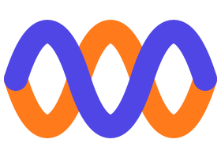

# Tarang brand guide

**Tarang** (तरंग) means *wave* in Hindi, Sanskrit and several other Indian languages. A voice is a wave, so is a
conversation, and Tarang carries both from one language to another.

| | |
|---|---|
| **Name** | Tarang. Always one word with a capital T. Never "TarangAI" in product UI. |
| **Tagline** | *Every voice, one wave.* |
| **Promise** | Talk to anyone in India, in their language. It's free, private and works offline. |
| **Personality** | Warm, calm, confident, inclusive. Like a helpful local friend, not a gadget. |

## 1. The mark

 &nbsp; 

Two voices, one **white** and one **saffron**, braid into a single wave. They cross three times, so each side gets
heard and answered in turn. That is the core of the product: two languages taking turns in one conversation.

* **App icon:** the braid on the signature gradient tile (`res/drawable/ic_launcher_*.xml`, `docs/brand/logo.svg`).
* **Mark only:** the braid in Indigo and Saffron on light backgrounds (`docs/brand/mark.svg`).
* **Themed icon (Android 13+):** a monochrome version is included.
* **Geometry:** built on a 108-unit grid. Strokes are 6 units wide with round caps, spanning x = 30 to 78, so the mark
  stays inside the adaptive-icon safe zone.
* **Don't:** recolour the strands, add a third wave, outline the mark, or place it on busy photos.

## 2. Colour

| Token | Hex | Use |
|---|---|---|
| **Tarang Indigo** | `#4F46E5` | Primary actions, your side of a conversation, links |
| **Indigo Deep** | `#2B2580` | Gradient start, text on white buttons |
| **Violet** | `#7C3AED` | Gradient end, Live captions accent |
| **Saffron** | `#FF7A1A` | *Active voice*: the mic while listening, speaking state, favourites |
| **Peacock Teal** | `#0EA5A4` | The other person's side, "offline ready" states, Scan accent |
| **Ink** | `#0B0D1A` | Dark-theme background |
| **Mist** | `#F7F7FC` | Light-theme background |

**Signature gradient:** Indigo Deep → Indigo → Violet at 135°. Use it on the hero card, onboarding, splash, the
full-screen "show" mode and the app icon. It is a stage for moments, not wallpaper, so don't use it on list items.

**The saffron rule:** saffron means *a voice is live right now*. If something is saffron, either sound is going in
or sound is coming out. That makes the state readable at a glance, even in a noisy market.

Dynamic colour (Material You) is deliberately **off**, so Tarang looks the same on every phone. Light and dark schemes
are defined in `ui/theme/Theme.kt`.

## 3. Typography

* **System sans (Roboto / Noto)** adds nothing to the APK and has excellent Indic script coverage through Noto.
* **Headlines:** Bold, tracking −0.25 to −0.5.
* **Translations** are always larger than the source text (26 sp in Text mode, 21–24 sp in conversation and captions)
  with generous line height (~1.45×), because Indic scripts need room above and below the line.
* Every language is shown in **its own script first** (हिन्दी, தமிழ், ગુજરાતી …) with the English name as a caption.
* Text direction is detected per string, so Urdu renders right-to-left automatically.

## 4. Shape & motion

* Rounded and friendly: 12 dp for chips, 20–24 dp for cards, 28–32 dp for hero surfaces, and fully round mics.
* **The wave** (`TarangWave`) is the motion signature: three tapered sine lines whose amplitude follows the
  microphone level. Use it for listening states and brand moments only.
* The swap button rotates 180° when you swap languages. Screens slide in by 20% and fade.

## 5. Voice & tone

* Short, human sentences: "Didn't catch that. Try again", not "Recognition error 7".
* Address the person directly ("Tap the mic and speak Hindi").
* Prompts meant for the *other* person are written in **their** language (बोलिए, பேசுங்கள், ಮಾತನಾಡಿ …).
* Be honest about limits. If something needs the internet or a download, say so and give the one-tap fix.

## 6. Iconography

Material Symbols **Rounded** only. Mode accents:

| Mode | Icon | Accent |
|---|---|---|
| Conversation | RecordVoiceOver | Indigo / Teal |
| Live captions | ClosedCaption | Violet |
| Type | Keyboard | Indigo |
| Scan | DocumentScanner | Teal |
| Phrasebook | MenuBook | Saffron |
